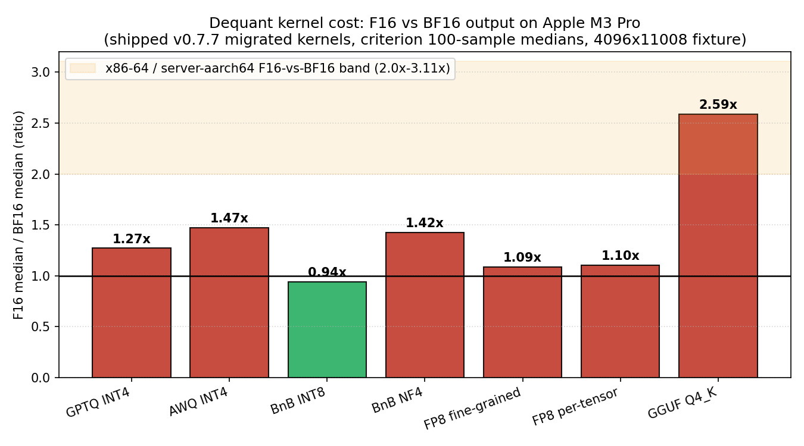
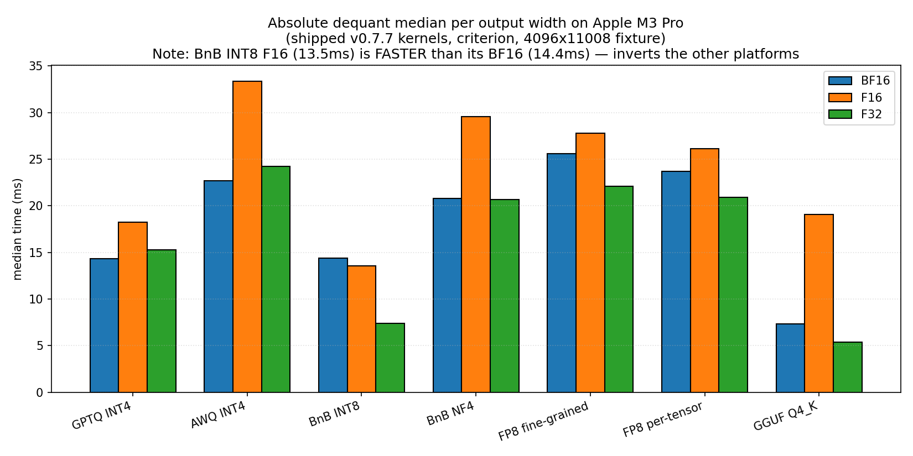
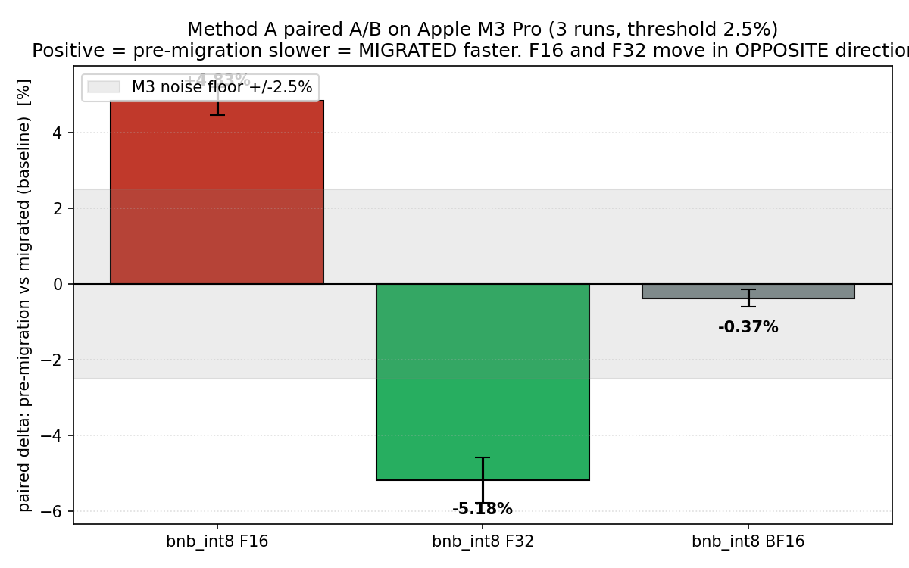

# Issue #11 — BnB INT8 F16 on Apple Silicon — Findings (v0)

Date: 2026-08-23

---
type: findings
topic: issue11_bnb_int8_f16_m3
date: 2026-08-23
version: v0
prior-version: none
key-metric: bnb_int8 F16 paired delta: +4.8% (prior: N/A, delta: N/A)
decision-required: confirm
---

## Headline Result

metric: `bnb_int8` F16 paired delta (pre-migration vs migrated)
value: +4.83 %
unit: % (mean of 3 paired runs, threshold 2.5 %)
prior: N/A
direction: up

> Read as: the migrated (shipped, v0.7.7) kernel is ~5 % **faster** at F16 than the
> pre-migration kernel on Apple M3 Pro — the `aarch64` regression does **not**
> reproduce on Apple Silicon; the direction matches x86-64, not server aarch64.

## Results Tables

### Paired A/B deltas — `bnb_int8` across widths (Method A, 3 runs)

Candidate = `033e763` (pre-migration), Baseline = `v0.7.7` (migrated, shipped).
Positive = candidate (pre-migration) is slower = **migrated is faster**.
`*` = significant at 2.5 % threshold (M3 self-check floor was ~2.5 %).

| Arm | Run 1 | Run 2 | Run 3 | Mean |
|-----|------:|------:|------:|-----:|
| `bnb_int8` F16 | **+4.59 % \*** | **+5.06 % \*** | **+4.83 % \*** | **+4.83 %** |
| `bnb_int8` F32 | **−5.27 % \*** | **−5.51 % \*** | **−4.77 % \*** | **−5.18 %** |
| `bnb_int8` BF16 | −0.54 % | −0.33 % | −0.25 % | −0.37 % |

Controls (untouched kernels, same runs): `awq / gptq / fp8 / bnb_nf4 / gguf_q4k`
stayed within ±1.8 % (one `fp8_fine_f32` +3.91 % moved the opposite direction and is
the control-set's own noise-envelope marker). The two `bnb_int8` arms move in
**opposite directions** across all three runs — not a thermal signature.

### Dequant absolute medians, shipped (migrated) kernels, M3 (criterion, 100 samples)

[source: `target/criterion/<fam>/.../new/estimates.json` — see `dequant_medians.json`]

| Family | BF16 (ms) | F16 (ms) | F32 (ms) | F16/BF16 |
|--------|----------:|---------:|---------:|---------:|
| gptq_int4 | 14.353 | 18.233 | 15.306 | 1.27x |
| awq_int4 | 22.678 | 33.387 | 24.240 | 1.47x |
| bnb_int8 | 14.364 | **13.533** | 7.380 | **0.94x** |
| bnb_nf4 | 20.765 | 29.576 | 20.676 | 1.42x |
| fp8_fine_grained | 25.595 | 27.814 | 22.095 | 1.09x |
| fp8_per_tensor | 23.670 | 26.142 | 20.904 | 1.10x |
| gguf_q4_k | 7.361 | 19.061 | 5.386 | 2.59x |

## Observations

| Signal | Baseline / Expected | Observed [source] | Interpretation |
|--------|--------------------|--------------------|----------------|
| Migration effect at F16 | +21 % regression on server-class `aarch64` (CodSpeed); −5 % win on x86-64 | `bnb_int8` F16 paired delta **+4.83 %** across 3 runs [source: `benches/ab.rs` compare output] | Migrated kernel is ~5 % faster at F16 on M3 → the aarch64 regression does **not** reproduce on Apple Silicon; matches x86-64 direction |
| F16 vs BF16 cost | 2.0–3.11x (x86-64), 2.10–2.93x (server aarch64), across all seven families [source: `docs/perf-experiments.md` Exp. 18] | `bnb_int8` F16/BF16 = **0.94x** on M3; other families 1.09–2.59x [source: criterion medians] | On M3, **`bnb_int8` F16 is slightly FASTER than its own BF16** — an inversion of the other two platforms. Suggests hardware FP16 changes the narrowing cost profile there |
| Width regression direction | F16 & F32 usually move together in a thermal drift | F16 **+4.8 %** and F32 **−5.2 %**, opposite across 3 runs [source: ab.rs compare] | Strongly rules out throttling as the driver (throttle is unidirectional); the effect is arm-specific and reproducible |
| Control spread | Untouched kernels moved ≤3.42 % on aarch64 replication | Untouched M3 arms ≤ ±1.8 % (one fp8_fine_f32 +3.91 %) [source: ab.rs compare] | `bnb_int8` F16 effect is ~2.7x the control spread → well above noise; reproducible |

## Charts & Visualizations

## Contradictions & Surprises

- `bnb_int8` F16 is **faster than its own BF16** (0.94x) on M3 — the only family below 1.0x, and the inverse of the 2–3x seen on x86-64 and server aarch64. This is the anomaly the issue's "What we do not know" section predicted might exist.
- The F32 arm regressed (−5.2 %) in the migration while F16 improved (+4.8 %) — on aarch64 both the F16 and (smaller) F32 effects were regressions; M3 shows them diverging.
- The F16-vs-BF16 cost table on `F16Out` needs a platform-specific caveat: it does **not** hold on M3 for `bnb_int8`.

## Steering Questions

- [now] Does the PI accept the "keep the change, do not revert" verdict, on the strength of a single (reproducible, triple-run) M3 measurement? The issue's own decision rule says absence on M-series ⇒ keep with a documented caveat.
- [next run] Should we confirm the `bnb_int8` F16 < BF16 inversion on a second M-series machine (different silicon tier, e.g. M2 vs M4) before it becomes a doc claim? Single-machine evidence.
- [next run] Add the M3 row to `F16Out`'s cost table and the `bnb.rs` module comment, replacing "unmeasured" with this data — including the 0.94x `bnb_int8` outlier and the 2.59x `gguf_q4_k`.
- [later] The `bnb_int8` F32 regression (−5.2 %) at F32-only was not in the issue's scope (F16 was). Worth a follow-up: does the as_chunks migration trade F16 speed for F32 speed on M3?

## Pointers

- [Issue #11](https://github.com/mi-for-the-rust-of-us/anamnesis/issues/11)
- `docs/perf-experiments.md` — Experiment 17 (as_chunks, instrument floors), Experiment 18 (F16 cost)
- `benches/ab.rs` — paired harness; `benches/dequant.rs` — criterion
- `src/remember/bnb.rs` — migration under test; `src/remember/output.rs` — `F16Out` cost section
- `dequant_medians.json` — raw medians extracted from `target/criterion/`
- `plots.py` — chart generation source (uv + matplotlib)
- Environment: Apple M3 Pro, macOS 26.5.2, rustc 1.92.0
